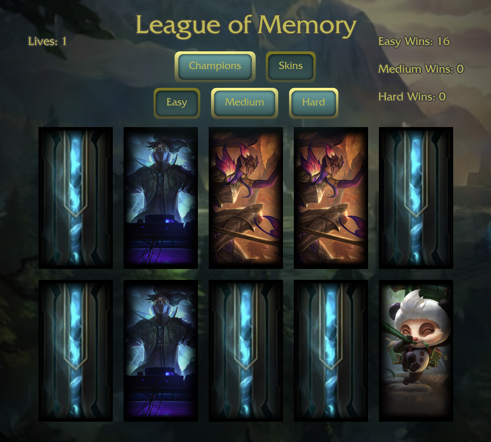

# League of Memory

League of Memory is a [Memory Card Game](https://en.wikipedia.org/wiki/Concentration_(card_game)) in which you can choose from 3 difficulties and choose whether the characters on the cards have a different look or not. Each difficulty has a set number of lives, and each win is counted on the scoreboard based on the difficulty. All IPs, characters, skins, and APIs used are from the popular online game [League of Legends](https://www.leagueoflegends.com/en-gb/).  

Made for fun and to practice React hooks such as useState() and useEffect().

### [Try it out!](https://league-of-memory.pages.dev)

All character splash arts are from [League Data Dragon.](https://developer.riotgames.com/docs/lol#data-dragon)  
Back of the cards from [League of Legends fandom.](https://leagueoflegends.fandom.com/wiki/Your_Shop)  
Favicon from [favicon.io.](https://favicon.io/favicon-generator/)  
Deployed using [Cloudflare Pages](https://pages.cloudflare.com).